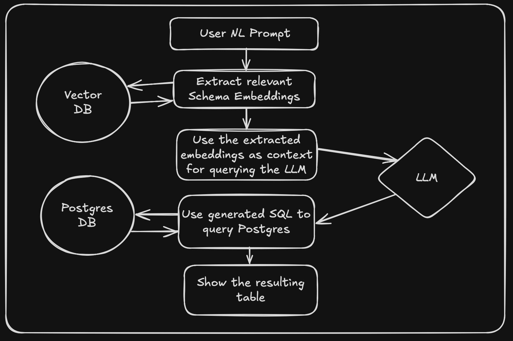

# TEXT-2-SQL

## Motivation & Inspiration

In all large companies, the business owners don't interact with the data on a day-to-day basis. They are restricted to using dashboards that show predefined KPIs or need to ask an analyst to run queries to get the data relevant for their business question. The latter might take anywhere between a few hours to few days.

What if there was an AI agent that can understand the business questions in natural language, run the required SQL queries and give the results directly in the chat (Slack/Teams/etc.)? This will reduce the time required to get the insights on business KPIs that are not predefined, but will directly affect the decisions to be made.

I came across the Text-2-SQL project done at Swiggy called [Hermes](https://bytes.swiggy.com/hermes-a-text-to-sql-solution-at-swiggy-81573fb4fb6e) and thought it is a good way to brush my NLP skills and learn how to deploy an AI application involving context engineering, RAG and finetuning LLMs.

## Objective

The objective is to develop an AI agentic application that generates SQL based on natural language prompts, runs the SQL and returns a response with the required KPI/stat/insight. The model should generate a valid SQL, run it and return a response in an insightful manner.

## Methodology

#### Version 0.1.0

For this version, I am using the open source LLM by Meta - Llama3.2:3b as the main LLM, [Weaviate](https://weaviate.io) as the Vector DB, PostgreSQL for hosting the open source dataset [Pagila](https://github.com/devrimgunduz/pagila) and streamlit for the app UI.

